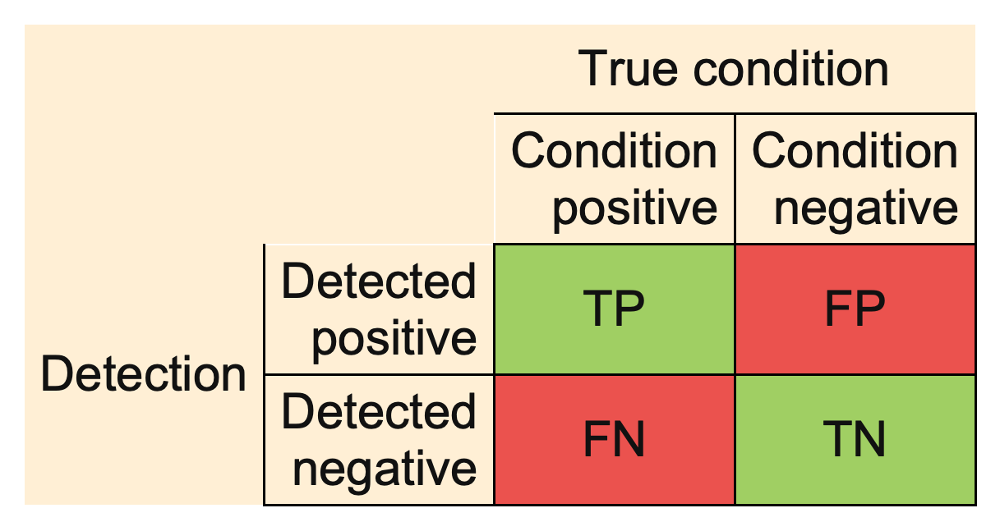
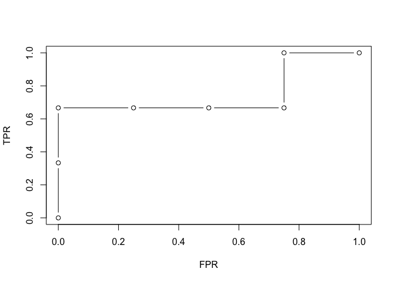

<!-- README.md is generated from README.Rmd. Please edit that file -->

# evabic <a href='https://abichat.github.io/evabic'></a>

<!-- badges: start -->

[](https://www.gnu.org/licenses/gpl-3.0.en.html)
[](https://www.tidyverse.org/lifecycle/#maturing)
[](https://github.com/abichat/evabic/blob/master/DESCRIPTION)
[](https://cran.r-project.org/package=evabic)
[](https://codecov.io/gh/abichat/evabic?branch=master)
[](https://www.codacy.com/app/abichat/evabic?utm_source=github.com&utm_medium=referral&utm_content=abichat/evabic&utm_campaign=Badge_Grade)
[](https://github.com/abichat/evabic/actions)
[](https://abichat.github.io/evabic/)
[](https://github.com/abichat/evabic/commits/master)
<!-- badges: end -->

**evabic** aims to **eva**luate **bi**nary **c**lassifiers by specifying
what is detected as true and what is actually true. It has no
dependencies.

## Installation

You can install the development version from
[GitHub](https://github.com/) with:

``` r
# install.packages("remotes")
remotes::install_github("abichat/evabic")
```

## Measures

**evabic** provides handy functions to compute 18 different measures.
Each function begins with `ebc_*`.

Available measures include True Positive Rate (Sensitivity or Recall),
True Negative Rate (Specificity), Positive Predictive Value (Precision),
False Discovery Rate, Accuracy, F1…

``` r
evabic::ebc_allmeasures
#>  [1] "TP"   "FP"   "FN"   "TN"   "TPR"  "TNR"  "PPV"  "NPV"  "FNR"  "FPR" 
#> [11] "FDR"  "FOR"  "ACC"  "BACC" "F1"   "PLR"  "NLR"  "DOR"
```

All measures are computed from the confusion matrix:

<center>



</center>

## Example

Let’s use **evabic** on a toy example.

``` r
library(evabic)
```

Consider three variables `X1`, `X2` and `X3`, `Y` a variable predicted
by this three variables, and 4 more conditionally independent variables
`X4` to `X7`.

``` r
set.seed(42)
X1 <- rnorm(50)
X2 <- rnorm(50)
X3 <- rnorm(50)
predictors <- paste0("X", 1:3)

df_lm <- data.frame(X1 = X1, X2 = X2, X3 = X3, 
                    X4 = X1 + X2 + X3 + rnorm(50, sd = 0.5),
                    X5 = X1 + 3 * X3 + rnorm(50, sd = 0.5),
                    X6 = X2 - 2 * X3 + rnorm(50, sd = 0.5),
                    X7 = X1 - 0.2 * X2 + rnorm(50, sd = 2),
                    Y  = X1 - 0.2 * X2 + 3 * X3 + rnorm(50))
```

We use a linear regression to detect the actual predictors (do not
select significant variables like this at home, it’s a bad way to do
so).

``` r
model <- lm(Y ~ ., data = df_lm)
summary(model)
#> 
#> Call:
#> lm(formula = Y ~ ., data = df_lm)
#> 
#> Residuals:
#>      Min       1Q   Median       3Q      Max 
#> -1.66504 -0.65784 -0.05977  0.51720  2.14833 
#> 
#> Coefficients:
#>             Estimate Std. Error t value Pr(>|t|)   
#> (Intercept)  0.13537    0.14528   0.932  0.35678   
#> X1           1.35385    0.44929   3.013  0.00437 **
#> X2           0.09974    0.46105   0.216  0.82977   
#> X3           3.67893    1.18759   3.098  0.00347 **
#> X4          -0.22998    0.33164  -0.693  0.49183   
#> X5          -0.17073    0.30744  -0.555  0.58161   
#> X6          -0.04023    0.28381  -0.142  0.88795   
#> X7           0.07055    0.09245   0.763  0.44966   
#> ---
#> Signif. codes:  0 '***' 0.001 '**' 0.01 '*' 0.05 '.' 0.1 ' ' 1
#> 
#> Residual standard error: 1.005 on 42 degrees of freedom
#> Multiple R-squared:  0.921,  Adjusted R-squared:  0.9079 
#> F-statistic: 69.99 on 7 and 42 DF,  p-value: < 2.2e-16
pvalues <- summary(model)$coefficients[-1, 4]
pvalues
#>          X1          X2          X3          X4          X5          X6 
#> 0.004366456 0.829771754 0.003469737 0.491828466 0.581608670 0.887948400 
#>          X7 
#> 0.449664443
detected_var <- names(pvalues[pvalues < 0.05])
detected_var
#> [1] "X1" "X3"
```

Here, we selected two predictors among the three true predictors.

Single measures are available with `ebc_*()` functions.

``` r
ebc_TPR(detected = detected_var, true = predictors)
#> [1] 0.6666667
ebc_ACC(detected = detected_var, true = predictors, m = 7) # the total size of the set is 7
#> [1] 0.8571429
```

You can also ask for several measures in a single row summary format
with `ebc_tidy()`.

``` r
ebc_tidy(detected = detected_var, true = predictors, m = 7, 
         # you can use `measures = ebc_allmeasures` to compute all measures
         measures = c("TPR", "TNR", "FDR", "ACC", "BACC", "F1")) 
#>         TPR TNR FDR       ACC      BACC  F1
#> 1 0.6666667   1   0 0.8571429 0.8333333 0.8
```

Note that **evabic** also supports named logicals for `detected` and
`true` arguments, but they must be named (see the `add_names()` function
if needed).

``` r
pvalues < 0.05
#>    X1    X2    X3    X4    X5    X6    X7 
#>  TRUE FALSE  TRUE FALSE FALSE FALSE FALSE
ebc_tidy(detected = pvalues < 0.05, true = predictors, m = 7, 
         measures = c("TPR", "TNR", "FDR", "ACC", "BACC", "F1"))
#>         TPR TNR FDR       ACC      BACC  F1
#> 1 0.6666667   1   0 0.8571429 0.8333333 0.8
```

With `ebc_tidy_by_threshold()`, you can ask for the evolution of
measures according to a moving threshold if you provide the vector of
p-values (or any
score).

``` r
df_measures <- ebc_tidy_by_threshold(detection_values = pvalues, true = predictors, m = 7, 
                                     measures = c("TPR", "FPR", "FDR", "ACC", "BACC", "F1"))
df_measures
#>     threshold       TPR  FPR       FDR       ACC      BACC        F1
#> 1 0.003469737 0.0000000 0.00       NaN 0.5714286 0.5000000 0.0000000
#> 2 0.004366456 0.3333333 0.00 0.0000000 0.7142857 0.6666667 0.5000000
#> 3 0.449664443 0.6666667 0.00 0.0000000 0.8571429 0.8333333 0.8000000
#> 4 0.491828466 0.6666667 0.25 0.3333333 0.7142857 0.7083333 0.6666667
#> 5 0.581608670 0.6666667 0.50 0.5000000 0.5714286 0.5833333 0.5714286
#> 6 0.829771754 0.6666667 0.75 0.6000000 0.4285714 0.4583333 0.5000000
#> 7 0.887948400 1.0000000 0.75 0.5000000 0.5714286 0.6250000 0.6666667
#> 8         Inf 1.0000000 1.00 0.5714286 0.4285714 0.5000000 0.6000000
```

This makes it easy to plot various-threshold curves like ROC
curve.

``` r
plot(df_measures$FPR, df_measures$TPR, type = "b", xlab = "FPR", ylab = "TPR")
```



And finally, you can ask for the AUC, the area under the ROC curve.

``` r
ebc_AUC(detection_values = pvalues, true = predictors, m = 7)
#> [1] 0.75
ebc_AUC_from_measures(df_measures)
#> [1] 0.75
```
